# Laravel ERP - Milestone Mapping & Dependency Graph

**Version:** 3.0  
**Last Updated:** November 10, 2025  
**MVP Target:** March 31, 2026 (20 weeks)  
**Status:** Active Development

---

## Overview

This document maps Product Requirements Documents (PRDs) to GitHub Milestones, tracks issue dependencies, and provides visual representations of the project structure and delivery schedule.

**Major Update:** MVP scope expanded to include **visible business functionality** that stakeholders can see in action: Chart of Accounts, General Ledger, Journal Entries, Accounts Payable, Accounts Receivable, Banking, Basic HCM, and Basic Inventory Management.

### Hierarchy

```
Main PRD (PRD-CONSOLIDATED-v2.md)
  └── sub-PRD (Requirements)
      └── Milestone (Delivery Tracking)
          └── Issue (Work Item) [Max 7 per sub-PRD]
              └── Task (Granular Steps) [Unlimited per Issue]
```

---

## Milestone Overview


---

## Milestone 1: Core Infrastructure Foundation

**Target Date:** November 30, 2025  
**Duration:** 3 weeks  
**Status:** 🚧 In Progress  
**GitHub Milestone:** [Milestone 1](https://github.com/azaharizaman/laravel-erp/milestone/1)

### Objective
Establish secure, multi-tenant foundation with basic authentication operational.

### PRDs Included

| PRD | Module | Issues | Status |
|-----|--------|--------|--------|
| PRD-01 | Multi-tenancy Infrastructure | 0 (Completed) | ✅ Done |
| PRD-02A | Core Authentication (Part 1) | 7 issues | 🚧 In Progress |

### Success Criteria
- ✅ Multi-tenancy with tenant isolation working
- ✅ Users can register, login, logout
- ✅ Tenant-scoped RBAC with Spatie Permission
- ✅ API token authentication via Sanctum
- ✅ Basic password security (hashing, lockout)

---

## Milestone 2: Auth Completion & Audit

**Target Date:** December 15, 2025  
**Duration:** 2 weeks  
**Status:** 📋 Planned  
**GitHub Milestone:** [Milestone 2](https://github.com/azaharizaman/laravel-erp/milestone/2)

### Objective
Complete authentication features and implement comprehensive audit logging.

### PRDs Included

| PRD | Module | Issues | Status |
|-----|--------|--------|--------|
| PRD-02B | User & Role Management (Part 2) | 4 issues | 📋 Planned |
| PRD-02C | Advanced Security & Testing (Part 3) | 5 issues | 📋 Planned |
| PRD-03 | Audit Logging & Activity Tracking | 7 issues | 📋 Planned |

### Success Criteria
- ✅ Complete auth system with MFA, password reset
- ✅ User and role management APIs
- ✅ CLI commands for admin operations
- ✅ Comprehensive audit logging with blockchain option
- ✅ Rate limiting and security features
- ✅ Complete test coverage (≥80%)

---

## Milestone 3: Infrastructure Finalization

**Target Date:** December 31, 2025  
**Duration:** 16 days  
**Status:** 📋 Planned  
**GitHub Milestone:** [Milestone 3](https://github.com/azaharizaman/laravel-erp/milestone/3)

### Objective
Complete foundational infrastructure with serial numbering, settings, UOM, GraphQL, and AI automation.

### PRDs Included

| PRD | Module | Issues | Status |
|-----|--------|--------|--------|
| PRD-04 | Serial Numbering System | 7 issues | 📋 Planned |
| PRD-05 | Settings Management | 6 issues | 📋 Planned |
| PRD-13 | Unit of Measure (UOM) | 6 issues | 📋 Planned |
| PRD-00A | GraphQL API Foundation | 3 issues | 📋 Planned |
| PRD-00B | AI Automation Foundation | 2 issues | 📋 Planned |

### Success Criteria
- ✅ Auto-generated serial numbers for documents
- ✅ Configurable patterns per tenant
- ✅ Hierarchical settings system
- ✅ UOM master data with conversion factors
- ✅ GraphQL schema for core modules
- ✅ AI automation hooks via HuggingFace PHP
- ✅ Infrastructure fully tested and documented

---

## Milestone 4: Chart of Accounts & General Ledger

**Target Date:** January 15, 2026  
**Duration:** 15 days  
**Status:** 📋 Planned  
**GitHub Milestone:** [Milestone 4](https://github.com/azaharizaman/laravel-erp/milestone/4)

### Objective
Implement financial foundation with Chart of Accounts (CoA) and General Ledger (GL) for accounting operations.

### PRDs Included

| PRD | Module | Issues | Status |
|-----|--------|--------|--------|
| PRD-06 | Chart of Accounts (CoA) | 6 issues | 📋 Planned |
| PRD-07 | General Ledger (GL) | 7 issues | 📋 Planned |

### Success Criteria
- ✅ Multi-level account hierarchy (Assets, Liabilities, Equity, Revenue, Expenses)
- ✅ Account types and classifications
- ✅ GL posting and transaction recording
- ✅ Trial balance generation
- ✅ Multi-tenant CoA isolation
- ✅ API endpoints for account management
- ✅ Comprehensive testing

---

## Milestone 5: Journal Entries & Banking

**Target Date:** January 31, 2026  
**Duration:** 16 days  
**Status:** 📋 Planned  
**GitHub Milestone:** [Milestone 5](https://github.com/azaharizaman/laravel-erp/milestone/5)

### Objective
Enable manual accounting transactions and bank account management for financial operations.

### PRDs Included

| PRD | Module | Issues | Status |
|-----|--------|--------|--------|
| PRD-08 | Journal Entries | 7 issues | 📋 Planned |
| PRD-11 | Banking & Reconciliation | 6 issues | 📋 Planned |

### Success Criteria
- ✅ Manual journal entry creation
- ✅ Debit/credit validation and balance checking
- ✅ Journal entry approval workflow
- ✅ Bank account management
- ✅ Bank transaction reconciliation
- ✅ Integration with GL
- ✅ Complete testing and documentation

---

## Milestone 6: Accounts Payable & Receivable

**Target Date:** February 21, 2026  
**Duration:** 21 days  
**Status:** 📋 Planned  
**GitHub Milestone:** [Milestone 6](https://github.com/azaharizaman/laravel-erp/milestone/6)

### Objective
Implement transactional modules for vendor bill processing (AP) and customer invoice management (AR).

### PRDs Included

| PRD | Module | Issues | Status |
|-----|--------|--------|--------|
| PRD-09 | Accounts Payable (AP) | 7 issues | 📋 Planned |
| PRD-10 | Accounts Receivable (AR) | 7 issues | 📋 Planned |

### Success Criteria
- ✅ Vendor bill management (create, approve, pay)
- ✅ Automatic GL posting from AP transactions
- ✅ AP aging reports
- ✅ Customer invoice management (create, send, collect)
- ✅ Automatic GL posting from AR transactions
- ✅ AR aging reports
- ✅ Payment tracking and reconciliation
- ✅ Complete testing

---

## Milestone 7: Basic HCM & Inventory

**Target Date:** March 14, 2026  
**Duration:** 21 days  
**Status:** 📋 Planned  
**GitHub Milestone:** [Milestone 7](https://github.com/azaharizaman/laravel-erp/milestone/7)

### Objective
Implement basic operational modules for staff management and inventory item master data.

### PRDs Included

| PRD | Module | Issues | Status |
|-----|--------|--------|--------|
| PRD-12 | Basic HCM - Staff Management | 6 issues | 📋 Planned |
| PRD-14 | Basic Inventory - Item Master | 6 issues | 📋 Planned |

### Success Criteria
- ✅ Employee/staff master data management
- ✅ Department and position structure
- ✅ Basic staff information tracking (not full payroll)
- ✅ Inventory item master data
- ✅ Item categories and attributes
- ✅ Multi-UOM support for items
- ✅ Integration with existing modules
- ✅ Complete testing

---

## Milestone 8: Integration, Testing & MVP Launch

**Target Date:** March 31, 2026  
**Duration:** 17 days  
**Status:** 📋 Planned  
**GitHub Milestone:** [Milestone 8](https://github.com/azaharizaman/laravel-erp/milestone/8)

### Objective
Complete end-to-end integration testing, performance optimization, stakeholder demo preparation, and MVP launch.

### PRDs Included

| Task Category | Activities | Status |
|---------------|-----------|--------|
| Integration Testing | Cross-module workflows, data consistency | 📋 Planned |
| Performance Testing | Load testing, optimization | 📋 Planned |
| Documentation | API docs, user guides, deployment docs | 📋 Planned |
| Security Audit | Penetration testing, vulnerability scanning | 📋 Planned |
| Demo Preparation | Stakeholder demo data, presentation materials | 📋 Planned |

### Success Criteria
- ✅ All modules integrated and working together
- ✅ End-to-end workflows tested (create invoice → GL posting → payment → bank reconciliation)
- ✅ Performance benchmarks met (< 200ms API response time)
- ✅ Security audit passed
- ✅ Complete documentation
- ✅ Stakeholder demo ready
- ✅ Production deployment successful
- ✅ MVP officially launched

---

## PRD to Milestone Mapping

```mermaid
graph TB
    subgraph "Infrastructure (Weeks 1-7)"
        M1[Milestone 1<br/>Core Infrastructure<br/>Nov 10-30]
        M2[Milestone 2<br/>Auth & Audit<br/>Dec 1-15]
        M3[Milestone 3<br/>Infrastructure Final<br/>Dec 16-31]
    end
    
    subgraph "Financial Core (Weeks 8-11)"
        M4[Milestone 4<br/>CoA & GL<br/>Jan 1-15]
        M5[Milestone 5<br/>Journal & Banking<br/>Jan 16-31]
    end
    
    subgraph "Transactional (Weeks 12-14)"
        M6[Milestone 6<br/>AP & AR<br/>Feb 1-21]
    end
    
    subgraph "Operational (Weeks 15-17)"
        M7[Milestone 7<br/>HCM & Inventory<br/>Feb 22-Mar 14]
    end
    
    subgraph "Launch (Weeks 18-20)"
        M8[Milestone 8<br/>Integration & Testing<br/>Mar 15-31]
    end
    
    subgraph "Layer 0: Core Architecture"
        PRD01[PRD-01<br/>Multi-tenancy<br/>✅ Complete]
        PRD00A[PRD-00A<br/>GraphQL API<br/>3 issues]
        PRD00B[PRD-00B<br/>AI Automation<br/>2 issues]
    end
    
    subgraph "Layer 1: Infrastructure"
        PRD02A[PRD-02A<br/>Core Auth<br/>7 issues]
        PRD02B[PRD-02B<br/>User Mgmt<br/>4 issues]
        PRD02C[PRD-02C<br/>Security<br/>5 issues]
        PRD03[PRD-03<br/>Audit<br/>7 issues]
        PRD04[PRD-04<br/>Serial Numbers<br/>7 issues]
        PRD05[PRD-05<br/>Settings<br/>6 issues]
        PRD13[PRD-13<br/>UOM<br/>6 issues]
    end
    
    subgraph "Layer 2: Business Modules"
        PRD06[PRD-06<br/>Chart of Accounts<br/>6 issues]
        PRD07[PRD-07<br/>General Ledger<br/>7 issues]
        PRD08[PRD-08<br/>Journal Entries<br/>7 issues]
        PRD11[PRD-11<br/>Banking<br/>6 issues]
        PRD09[PRD-09<br/>Accounts Payable<br/>7 issues]
        PRD10[PRD-10<br/>Accounts Receivable<br/>7 issues]
        PRD12[PRD-12<br/>Basic HCM<br/>6 issues]
        PRD14[PRD-14<br/>Basic Inventory<br/>6 issues]
    end
    
    %% Milestone Dependencies
    M1 --> M2
    M2 --> M3
    M3 --> M4
    M4 --> M5
    M5 --> M6
    M6 --> M7
    M7 --> M8
    
    %% Infrastructure PRDs to Milestones
    PRD01 --> M1
    PRD02A --> M1
    PRD02B --> M2
    PRD02C --> M2
    PRD03 --> M2
    PRD04 --> M3
    PRD05 --> M3
    PRD13 --> M3
    PRD00A --> M3
    PRD00B --> M3
    
    %% Financial PRDs to Milestones
    PRD06 --> M4
    PRD07 --> M4
    PRD08 --> M5
    PRD11 --> M5
    
    %% Transactional PRDs to Milestones
    PRD09 --> M6
    PRD10 --> M6
    
    %% Operational PRDs to Milestones
    PRD12 --> M7
    PRD14 --> M7
    
    %% Module Dependencies
    PRD01 -.Blocks.-> PRD02A
    PRD02A -.Blocks.-> PRD02B
    PRD01 -.Blocks.-> PRD03
    PRD01 -.Blocks.-> PRD04
    PRD01 -.Blocks.-> PRD05
    PRD01 -.Blocks.-> PRD13
    
    PRD13 -.Required by.-> PRD06
    PRD06 -.Required by.-> PRD07
    PRD07 -.Required by.-> PRD08
    PRD07 -.Required by.-> PRD11
    PRD07 -.Required by.-> PRD09
    PRD07 -.Required by.-> PRD10
    PRD01 -.Required by.-> PRD12
    PRD13 -.Required by.-> PRD14
    
    %% Styling
    style PRD01 fill:#90EE90
    style M1 fill:#FFE4B5
    style M2 fill:#FFE4B5
    style M3 fill:#FFE4B5
    style M4 fill:#FFD700
    style M5 fill:#FFD700
    style M6 fill:#87CEEB
    style M7 fill:#DDA0DD
    style M8 fill:#98FB98
```


    
    style PRD01 fill:#90EE90
    style M1 fill:#FFE4B5
    style M2 fill:#FFE4B5
    style M3 fill:#FFE4B5
    style M4 fill:#FFE4B5
```

---

## Issue Dependency Graph

```mermaid
graph LR
    subgraph "PRD-01: Multi-tenancy ✅"
        I01[Issue #1-19<br/>All Complete]
    end
    
    subgraph "PRD-02A: Core Auth (M1)"
        I20[#78: User Model<br/>& Database]
        I21[#79: Sanctum<br/>Integration]
        I22[#80: Spatie<br/>Permission]
        I23[#81: Roles &<br/>Permissions]
        I24[#82: Basic Auth<br/>Actions]
        I25[#83: MFA<br/>Implementation]
        I26[#84: Account<br/>Security]
    end
    
    subgraph "PRD-02B: User Mgmt (M2)"
        I27[#85: API<br/>Endpoints]
        I28[#86: Validation]
        I29[#87: User Mgmt<br/>API]
        I30[#88: Role/Perm<br/>API]
    end
    
    subgraph "PRD-02C: Security (M2)"
        I31[#89: Policies]
        I32[#90: CLI<br/>Commands]
        I33[#91: Rate<br/>Limiting]
        I34[#92: Events]
        I35[#93: Testing]
    end
    
    subgraph "PRD-03: Audit (M2)"
        I36[#94: Activity<br/>Setup]
        I37[#95: Custom<br/>Logger]
        I38[#96: Critical<br/>Ops]
        I39[#97: Blockchain]
        I40[#98: Export<br/>API]
        I41[#99: Auth<br/>Events]
        I42[#100: Testing]
    end
    
    subgraph "PRD-04: Serial Numbers (M3)"
        I43[#101: Package<br/>Install]
        I44[#102: Pattern<br/>Config]
        I45[#103: Model<br/>Integration]
        I46[#104: Manual<br/>Override]
        I47[#105: Tenant<br/>Support]
        I48[#106: API<br/>Layer]
        I49[#107: Testing]
    end
    
    subgraph "PRD-05: Settings (M3)"
        I50[#108: Schema &<br/>Model]
        I51[#109: Setting<br/>Types]
        I52[#110: Hierarchy]
        I53[#111: API<br/>Endpoints]
        I54[#112: CLI<br/>Commands]
        I55[#113: Testing]
    end
    
    subgraph "PRD-13: UOM (M4)"
        I56[#114: UOM<br/>Model]
        I57[#115: Conversion<br/>Logic]
        I58[#116: UOM<br/>Groups]
        I59[#117: Multi-unit<br/>Support]
        I60[#118: API<br/>Layer]
        I61[#119: Testing]
    end
    
    subgraph "PRD-00A: GraphQL (M4)"
        I62[#120: Schema<br/>Setup]
        I63[#121: Resolvers]
        I64[#122: Testing]
    end
    
    subgraph "PRD-00B: AI (M4)"
        I65[#123: HuggingFace<br/>Integration]
        I66[#124: AI<br/>Hooks]
    end
    
    %% Dependencies
    I01 -.Blocks.-> I20
    I20 --> I21
    I21 --> I22
    I22 --> I23
    I23 --> I24
    I24 --> I25
    I25 --> I26
    
    I26 --> I27
    I27 --> I28
    I28 --> I29
    I29 --> I30
    
    I30 --> I31
    I31 --> I32
    I32 --> I33
    I33 --> I34
    I34 --> I35
    
    I24 -.Blocks.-> I36
    I26 -.Blocks.-> I37
    I36 --> I37
    I37 --> I38
    I38 --> I39
    I39 --> I40
    I40 --> I41
    I41 --> I42
    
    I01 -.Blocks.-> I43
    I43 --> I44
    I44 --> I45
    I45 --> I46
    I46 --> I47
    I47 --> I48
    I48 --> I49
    
    I01 -.Blocks.-> I50
    I50 --> I51
    I51 --> I52
    I52 --> I53
    I53 --> I54
    I54 --> I55
    
    I01 -.Blocks.-> I56
    I56 --> I57
    I57 --> I58
    I58 --> I59
    I59 --> I60
    I60 --> I61
    
    I27 -.Blocks.-> I62
    I62 --> I63
    I63 --> I64
    
    I24 -.Blocks.-> I65
    I65 --> I66
    
    style I01 fill:#90EE90
    style I20 fill:#FFD700
    style I21 fill:#FFD700
    style I22 fill:#FFD700
```



---

## Issue Creation Priority Order

**Principle:** Create issues based on **Milestone → Dependency Chain**, not chronological order.

### Priority 1: Milestone 1 (Nov 10-30)
1. ✅ Issues #1-19 (PRD-01) - **COMPLETED**
2. 🚧 Issue #78 (PRD-02A) - User Model & Database
3. Issue #79 (PRD-02A) - Sanctum Integration
4. Issue #80 (PRD-02A) - Spatie Permission ← **YOU ARE HERE**
5. Issue #81 (PRD-02A) - Roles & Permissions Setup
6. Issue #82 (PRD-02A) - Basic Auth Actions
7. Issue #83 (PRD-02A) - MFA Implementation (optional for M1)
8. Issue #84 (PRD-02A) - Account Security Features

### Priority 2: Milestone 2 (Dec 1-15)
9. Issue #85 (PRD-02B) - API Endpoints
10. Issue #86 (PRD-02B) - Request Validation
11. Issue #87 (PRD-02B) - User Management API
12. Issue #88 (PRD-02B) - Role/Permission Management API
13. Issue #89 (PRD-02C) - Authorization Policies
14. Issue #90 (PRD-02C) - CLI Commands
15. Issue #91 (PRD-02C) - Rate Limiting
16. Issue #92 (PRD-02C) - Events & Listeners
17. Issue #93 (PRD-02C) - Comprehensive Testing
18. Issue #94 (PRD-03) - Activity Logging Setup
19. Issue #95 (PRD-03) - Custom Activity Logger
20. Issue #96 (PRD-03) - Critical Operations Identification
21. Issue #97 (PRD-03) - Blockchain Integration (optional)
22. Issue #98 (PRD-03) - Audit Export API
23. Issue #99 (PRD-03) - Authentication Event Logging
24. Issue #100 (PRD-03) - Audit Testing

### Priority 3: Milestone 3 (Dec 16-25)
25. Issue #101 (PRD-04) - Serial Numbering Package Install
26. Issue #102 (PRD-04) - Pattern Configuration
27. Issue #103 (PRD-04) - Model Integration
28. Issue #104 (PRD-04) - Manual Override Support
29. Issue #105 (PRD-04) - Multi-tenant Support
30. Issue #106 (PRD-04) - API Layer
31. Issue #107 (PRD-04) - Testing
32. Issue #108 (PRD-05) - Settings Schema & Model
33. Issue #109 (PRD-05) - Setting Types Implementation
34. Issue #110 (PRD-05) - Hierarchical Settings
35. Issue #111 (PRD-05) - Settings API Endpoints
36. Issue #112 (PRD-05) - CLI Commands
37. Issue #113 (PRD-05) - Testing

### Priority 4: Milestone 4 (Dec 26 - Jan 1)
38. Issue #114 (PRD-13) - UOM Model & Schema
39. Issue #115 (PRD-13) - Conversion Logic
40. Issue #116 (PRD-13) - UOM Groups
41. Issue #117 (PRD-13) - Multi-unit Support
42. Issue #118 (PRD-13) - API Layer
43. Issue #119 (PRD-13) - Testing
44. Issue #120 (PRD-00A) - GraphQL Schema Setup
45. Issue #121 (PRD-00A) - GraphQL Resolvers
46. Issue #122 (PRD-00A) - GraphQL Testing
47. Issue #123 (PRD-00B) - HuggingFace Integration
48. Issue #124 (PRD-00B) - AI Automation Hooks

---

## PRD Breakdown Summary

### Why PRD-02 Was Split

**Original PRD-02:**
- 17 implementation phases
- 178 tasks
- Would create 17+ issues ❌ **Violates 7-issue limit**

**New Structure:**
- **PRD-02A:** Core Authentication (Phases 1-7) → 7 issues ✅
- **PRD-02B:** User & Role Management (Phases 8-11) → 4 issues ✅
- **PRD-02C:** Advanced Security & Testing (Phases 12-17) → 5 issues ✅

### Issue Count by PRD

| PRD | Module | Issues | Tasks | Milestone |
|-----|--------|--------|-------|-----------|
| PRD-01 | Multi-tenancy | 0 | - | ✅ Complete |
| **PRD-02A** | Core Auth | **7** | 84 | M1 |
| **PRD-02B** | User Mgmt | **4** | 42 | M2 |
| **PRD-02C** | Security | **5** | 52 | M2 |
| **PRD-03** | Audit | **7** | 65 | M2 |
| **PRD-04** | Serial Numbers | **7** | 56 | M3 |
| **PRD-05** | Settings | **6** | 45 | M3 |
| **PRD-13** | UOM | **6** | 38 | M4 |
| **PRD-00A** | GraphQL | **3** | 24 | M4 |
| **PRD-00B** | AI | **2** | 15 | M4 |
| **TOTAL** | **MVP** | **47** | **421** | 4 Milestones |

All PRDs comply with **maximum 7 issues per sub-PRD** rule ✅

---

## Dependency Rules

### Cross-PRD Dependencies

```
PRD-01 (Multi-tenancy) BLOCKS:
  ├── PRD-02A (requires tenant_id in users table)
  ├── PRD-03 (requires tenant context for audit logs)
  ├── PRD-04 (requires tenant_id in serial number sequences)
  ├── PRD-05 (requires tenant_id in settings)
  └── PRD-13 (requires tenant_id in UOM data)

PRD-02A (Core Auth) BLOCKS:
  ├── PRD-03 (requires auth events for logging)
  ├── PRD-00A (requires auth for GraphQL)
  └── PRD-00B (requires auth for AI hooks)

PRD-02B (User Mgmt) BLOCKS:
  └── PRD-00A (requires user APIs for GraphQL schema)
```

### Intra-PRD Dependencies

**Within PRD-02A:**
```
Issue #78 (User Model) → Issue #79 (Sanctum) → Issue #80 (Permission) → 
Issue #81 (Roles) → Issue #82 (Auth Actions) → Issue #83 (MFA) → Issue #84 (Security)
```

**Within PRD-03:**
```
Issue #94 (Setup) → Issue #95 (Logger) → Issue #96 (Critical Ops) → 
Issue #97 (Blockchain) → Issue #98 (Export) → Issue #99 (Auth Events) → Issue #100 (Testing)
```

---

## GitHub Milestone Configuration

### Recommended GitHub Milestone Setup

**Milestone 1:**
- **Title:** Core Infrastructure Foundation
- **Due Date:** November 30, 2025
- **Description:**
  ```
  Multi-tenancy with tenant isolation + Core authentication with Sanctum & Spatie Permission
  
  PRDs: PRD-01 ✅, PRD-02A (7 issues)
  Issues: #1-19 (done), #78-84
  ```

**Milestone 2:**
- **Title:** Auth Completion & Audit
- **Due Date:** December 15, 2025
- **Description:**
  ```
  Complete authentication system + Comprehensive audit logging
  
  PRDs: PRD-02B (4 issues), PRD-02C (5 issues), PRD-03 (7 issues)
  Issues: #85-100
  ```

**Milestone 3:**
- **Title:** Business Foundations
- **Due Date:** December 25, 2025
- **Description:**
  ```
  Serial numbering system + Hierarchical settings management
  
  PRDs: PRD-04 (7 issues), PRD-05 (6 issues)
  Issues: #101-113
  ```

**Milestone 4:**
- **Title:** UOM & MVP Finalization
- **Due Date:** January 1, 2026 🎯
- **Description:**
  ```
  Unit of measure + GraphQL API + AI automation foundations + MVP finalization
  
  PRDs: PRD-13 (6 issues), PRD-00A (3 issues), PRD-00B (2 issues)
  Issues: #114-124
  MVP LAUNCH 🚀
  ```

---

## Progress Tracking

### Current Status (November 10, 2025)


**Completion:** 19/47 issues (40.4%)

### Weekly Targets

| Week | Dates | Target | Issues |
|------|-------|--------|--------|
| Week 1 | Nov 10-16 | Complete M1 Phase 1 | #78-81 (4 issues) |
| Week 2 | Nov 17-23 | Complete M1 Phase 2 | #82-84 (3 issues) |
| Week 3 | Nov 24-30 | Start M2 | #85-88 (4 issues) |
| Week 4 | Dec 1-7 | M2 Auth Completion | #89-93 (5 issues) |
| Week 5 | Dec 8-14 | M2 Audit Complete | #94-100 (7 issues) |
| Week 6 | Dec 15-21 | M3 Serial & Settings | #101-110 (10 issues) |
| Week 7 | Dec 22-28 | M3 Complete + M4 Start | #111-119 (9 issues) |
| Week 8 | Dec 29-Jan 1 | M4 Complete + MVP Launch 🚀 | #120-124 (5 issues) |

---

## Risk Mitigation

### Critical Path

```
PRD-01 → PRD-02A → PRD-02B → PRD-02C → PRD-03
                                      ↓
                              PRD-04 + PRD-05
                                      ↓
                         PRD-13 + PRD-00A + PRD-00B
                                      ↓
                                  MVP LAUNCH
```

**Any delay in Milestone 1 cascades to all subsequent milestones.**

### Contingency Plans

| Risk | Impact | Mitigation |
|------|--------|------------|
| M1 delay | High | Move MFA (Issue #83) to M2 |
| M2 Auth delay | Medium | Move blockchain audit (Issue #97) to post-MVP |
| M3 delay | Medium | Simplify serial number patterns |
| M4 delay | High | Move GraphQL/AI to post-MVP |

---

**Document Owner:** Core Development Team  
**Next Review:** November 17, 2025 (Weekly)  
**Approval:** Product Owner, Tech Lead
