# Laravel ERP System - Consolidated PRD v2.1


**Last Updated:** November 10, 2025  
**MVP Target:** 🎯 January 1, 2026  
**Delivery Model:** Milestone-based (4 milestones)

> **📋 See Also:** [MILESTONE-MAPPING.md](MILESTONE-MAPPING.md) for detailed milestone breakdown, issue dependencies, and progress tracking.

---

## Executive Summary

The Laravel ERP System is an **enterprise-grade, headless ERP backend** designed to rival SAP, Odoo, and Microsoft Dynamics while maintaining superior modularity, extensibility, and AI-powered automation capabilities. Built on Laravel 12+ and PHP 8.2+, the system follows a strict domain-driven design with contract-driven development, event-driven architecture, and complete package decoupling.

**MVP Delivery Target:** January 1, 2026 (8 weeks from kickoff)

### System Characteristics

- **Architecture:** Headless backend-only (RESTful API, GraphQL, WebSockets, Streaming)
- **Database:** Agnostic (MySQL, PostgreSQL, SQLite, SQL Server)
- **Integration:** AI automation via `azaharizaman/huggingface-php`
- **API Standards:** RESTful + GraphQL for flexible data querying
- **Design Philosophy:** Contract-driven, Domain-driven, Event-driven
- **Target Users:** AI agents, custom frontends, automated systems
- **Modularity:** Enable/disable modules without system-wide impact
- **Delivery Model:** Milestone-based with explicit issue dependencies

### MVP Scope (6 PRDs)

```mermaid
graph LR
    subgraph "MVP Delivery - Jan 1, 2026"
        M1[Milestone 1<br/>Infrastructure<br/>Nov 10-30] --> M2[Milestone 2<br/>Auth & Audit<br/>Dec 1-15]
        M2 --> M3[Milestone 3<br/>Business<br/>Dec 16-25]
        M3 --> M4[Milestone 4<br/>UOM & Final<br/>Dec 26 - Jan 1]
    end
    
    PRD01[PRD-01<br/>Multi-tenancy<br/>✅ Complete] --> M1
    PRD02A[PRD-02A<br/>Core Auth] --> M1
    PRD02B[PRD-02B<br/>User Mgmt] --> M2
    PRD02C[PRD-02C<br/>Security] --> M2
    PRD03[PRD-03<br/>Audit] --> M2
    PRD04[PRD-04<br/>Serial Numbers] --> M3
    PRD05[PRD-05<br/>Settings] --> M3
    PRD13[PRD-13<br/>UOM] --> M4
    PRD00A[PRD-00A<br/>GraphQL] --> M4
    PRD00B[PRD-00B<br/>AI Hooks] --> M4
    
    style PRD01 fill:#90EE90
    style M1 fill:#FFE4B5
    style M2 fill:#FFE4B5
    style M3 fill:#FFE4B5
    style M4 fill:#FFE4B5
```



**Total:** 9 sub-PRDs, 47 issues, 421 tasks

---

## 1. System Architecture & Classification

The system is organized into four hierarchical layers, each serving distinct purposes:

### 1.1 Core Architecture (Layer 0)

**Purpose:** Architectural and technical requirements of the system foundation.

**Status:** 🚧 In Progress (Multi-tenancy ✅, GraphQL 📋, AI 📋)

**Architecture Diagram:**

```mermaid
graph TB
    subgraph "Layer 0: Core Architecture"
        MT[Multi-Tenancy<br/>✅ Complete]
        DB[Database Design<br/>✅ Complete]
        API[API Architecture<br/>🚧 In Progress]
        PKG[Package Decoupling<br/>✅ High Priority Done]
        GQL[GraphQL Schema<br/>📋 Planned]
        AI[AI Automation<br/>📋 Planned]
    end
    
    subgraph "External Integration"
        REST[RESTful API<br/>/api/v1/*]
        GRAPHQL[GraphQL API<br/>/graphql]
        WS[WebSockets<br/>Real-time]
        STREAM[Streaming<br/>Large Exports]
        HF[HuggingFace PHP<br/>AI Models]
    end
    
    MT --> API
    DB --> API
    PKG --> API
    API --> REST
    API --> GRAPHQL
    API --> WS
    API --> STREAM
    GQL --> GRAPHQL
    AI --> HF
    
    style MT fill:#90EE90
    style DB fill:#90EE90
    style PKG fill:#90EE90
    style GQL fill:#FFE4B5
    style AI fill:#FFE4B5
    style API fill:#FFD700
```



**Components:**

#### 1.1.1 Multi-Tenancy Infrastructure
- **PRD Reference:** PRD-01 (Fully Implemented)
- **Status:** ✅ Complete
- **Scope:** Single-instance multi-organization support
- **Key Features:**
  - Tenant model with UUID primary keys
  - Global scope (TenantScope) for automatic filtering
  - Tenant context management via middleware
  - TenantManager service for operations
  - Tenant-specific configuration (JSON)
  - Tenant impersonation for support
  - Status management (active, suspended, archived)
- **Security:**
  - Database-level isolation
  - Cross-tenant access prevention
  - Audit logging for impersonation
  - Encrypted tenant configuration

#### 1.1.2 Database Design
- **Status:** ✅ Complete
- **Primary Keys:** UUID across all tables
- **Soft Deletes:** Enabled on all domain models
- **Indexing Strategy:**
  - Composite indexes: `(tenant_id, status)`, `(tenant_id, created_at)`
  - Foreign keys with cascade on delete
  - Full-text search indexes on searchable fields
- **Constraints:**
  - All tenant-aware tables have `tenant_id` foreign key
  - Unique constraints scoped to tenant
  - Check constraints for enum validation

#### 1.1.3 API Design
- **Status:** 🚧 In Progress (RESTful ✅, GraphQL 📋)
- **RESTful API:** `/api/v1/` namespace
- **GraphQL API:** Schema-first design (PRD-00A, Milestone 4)
- **WebSockets:** Real-time updates (future)
- **Streaming:** Large dataset exports (future)
- **Versioning:** URI versioning (`/v1/`, `/v2/`)
- **Response Format:** JSON:API specification
- **Pagination:** Cursor-based and offset-based
- **Rate Limiting:** Per user, per tenant, per endpoint

#### 1.1.4 GraphQL API Foundation (NEW)
- **PRD Reference:** PRD-00A (Milestone 4)
- **Status:** 📋 Planned
- **Purpose:** Flexible, client-driven data querying
- **Key Features:**
  - Schema-first design approach
  - Type-safe queries and mutations
  - Nested resource fetching (solve N+1 problem)
  - Real-time subscriptions via WebSockets
  - GraphQL Playground for API exploration
- **Implementation:**
  - Laravel Lighthouse or GraphQLite package
  - Tenant-scoped resolvers
  - Authorization via Sanctum + Policies
  - Rate limiting per query complexity
- **Use Cases:**
  - Complex data fetching for dashboards
  - Mobile app integration
  - Third-party API consumers
  - AI agent data queries

#### 1.1.5 AI Automation Foundation (NEW)
- **PRD Reference:** PRD-00B (Milestone 4)
- **Status:** 📋 Planned
- **Purpose:** AI-powered automation and intelligence
- **Package:** `azaharizaman/huggingface-php`
- **Key Features:**
  - Pre-trained model integration (sentiment, classification, NER)
  - Custom model fine-tuning support
  - Async job processing for ML inference
  - Result caching for performance
  - Webhook callbacks for long-running jobs
- **Integration Points:**
  - Invoice OCR and data extraction
  - Predictive inventory forecasting
  - Customer sentiment analysis
  - Anomaly detection in financial data
  - Automated document classification
- **Implementation:**
  - AI service abstraction contract
  - HuggingFace adapter implementation
  - Queue-based async processing
  - Result storage and versioning

#### 1.1.6 Package Decoupling Strategy
- **Status:** ✅ High Priority Packages Decoupled
- **Decoupled Packages:**
  - `spatie/laravel-activitylog` → ActivityLoggerContract ✅
  - `laravel/scout` → SearchServiceContract ✅
  - `laravel/sanctum` → TokenServiceContract ✅
  - `spatie/laravel-permission` → PermissionServiceContract ✅
- **Pattern:**
  - Contract-first design in `app/Support/Contracts/`
  - Adapter implementations in `app/Support/Services/{Category}/`
  - Wrapper traits in `app/Support/Traits/`
  - Service provider bindings
- **Benefits:**
  - Easy package replacement without code changes
  - Simplified testing with mocked contracts
  - Vendor lock-in prevention
  - Clear separation of concerns

---

### 1.2 Core Foundations (Layer 1)

**Purpose:** Hybrid technical and user requirements not specific to business use cases.

**Status:** 🚧 Partially Implemented

#### 1.2.1 Authentication & Authorization (🚧 In Progress)
- **PRD Reference:** PRD-02 (Implemented up to Spatie Permission with tenant-scoped RBAC)
- **Scope:** Secure API token-based auth with RBAC
- **Implemented:**
  - User model with UUID and tenant relationship
  - Laravel Sanctum integration
  - Spatie Permission with tenant scoping
  - Role hierarchy: Super Admin, Tenant Admin, Manager, User, API Client
  - Permission structure: `domain.action` (e.g., `inventory.view`, `sales.create`)
- **Pending:**
  - Multi-factor authentication (TOTP)
  - Account security features (lockout, failed login tracking)
  - Password reset flow
  - API endpoints for auth operations
  - Rate limiting configuration
  - Events & listeners for auth lifecycle
  - Comprehensive test suite

**Key Security Features:**
- Password hashing: bcrypt (cost factor 12)
- Password complexity: min 12 chars, mixed case, numbers, symbols
- Token expiration: 8 hours (configurable)
- Account lockout: 5 failed attempts, 30-minute lock
- Tenant-scoped permissions

**Roles & Permissions:**
| Role | Scope | Permissions |
|------|-------|-------------|
| **Super Admin** | Global | All permissions across all tenants |
| **Tenant Admin** | Tenant | Full control within tenant |
| **Manager** | Tenant | Limited management permissions |
| **User** | Tenant | Basic operational permissions |
| **API Client** | Tenant | Read-only API access |

**Permission Domains:**
- Core: `users.*`, `roles.*`, `permissions.*`
- Inventory: `inventory.*`, `warehouses.*`, `stock.*`
- Sales: `sales.*`, `customers.*`, `quotations.*`, `orders.*`
- Purchasing: `purchasing.*`, `vendors.*`, `purchase-orders.*`
- Backoffice: `backoffice.*`, `companies.*`, `offices.*`, `departments.*`, `staff.*`
- Accounting: `accounting.*`, `gl.*`, `ap.*`, `ar.*`

#### 1.2.2 Audit Logging & Activity Tracking
- **PRD Reference:** PRD-03
- **Status:** 📋 Planned
- **Scope:** Comprehensive activity logging with blockchain verification (optional)
- **Package:** `spatie/laravel-activitylog` (decoupled via ActivityLoggerContract)
- **Key Features:**
  - Model-level activity tracking
  - Custom activity logging service
  - Critical operation identification
  - Blockchain integration for immutability (optional)
  - Audit export API
  - Authentication event logging
  - Permission change logging
  - Tenant isolation for logs

#### 1.2.3 Serial Numbering System
- **PRD Reference:** PRD-04
- **Status:** 📋 Planned
- **Scope:** Configurable auto-incrementing serial numbers for documents
- **Package:** `azaharizaman/laravel-serial-numbering`
- **Patterns:**
  - Document types: Sales Order, Purchase Order, Invoice, Stock Movement, Item, Customer, Vendor, Quotation, GRN
  - Pattern variables: `{year}`, `{month}`, `{day}`, `{number}`, `{tenant}`
  - Reset periods: daily, monthly, yearly, never
  - Example: `SO-{year}{month}-{number}` → `SO-202511-00001`
- **Multi-tenant:** Separate numbering per tenant
- **Manual Override:** Allow manual number input with validation

#### 1.2.4 Settings Management
- **PRD Reference:** PRD-05
- **Status:** 📋 Planned
- **Scope:** Hierarchical configuration system
- **Levels:**
  - System-level settings (global)
  - Tenant-level settings
  - User-level preferences
  - Module-level configuration
- **Storage:** Database-backed with caching
- **Features:**
  - Type validation (string, integer, boolean, json, encrypted)
  - Default values with override capability
  - Setting groups and categories
  - API for CRUD operations
  - CLI commands for bulk operations
  - Event-driven setting changes

#### 1.2.5 Unit of Measure (UOM)
- **PRD Reference:** PRD-13
- **Status:** 📋 Planned
- **Scope:** Comprehensive UOM management with conversions
- **Package:** `azaharizaman/laravel-uom-management`
- **Features:**
  - Base units (kg, m, L, pcs, etc.)
  - Conversion factors (1 kg = 1000 g)
  - UOM groups (Weight, Length, Volume, Quantity)
  - Multi-unit items (buy in boxes, sell in pieces)
  - Automatic conversion in transactions
  - Tenant-specific custom UOMs

#### 1.2.6 Model Status Management
- **Scope:** State machine for domain models
- **Package:** `spatie/laravel-model-status` (to be decoupled)
- **Status Flows:**
  - **Orders:** Draft → Confirmed → Processing → Completed → Cancelled
  - **Invoices:** Draft → Sent → Paid → Overdue → Void
  - **Items:** Active → Inactive → Discontinued
  - **Users:** Active → Inactive → Locked → Suspended
- **Features:**
  - Transition validation
  - Status history tracking
  - Event dispatching on status change
  - Custom status reasons

---

### 1.3 Core Modules (Layer 2)

**Purpose:** Essential business features for general industry use cases. Can be toggled but not completely disabled.

**Status:** 📋 Planned (Target: MVP)

#### 1.3.1 Financial Management

##### 1.3.1.1 General Ledger (GL)
- **Scope:** Double-entry accounting system
- **Features:**
  - Chart of accounts (COA) with hierarchical structure
  - Account types: Asset, Liability, Equity, Revenue, Expense
  - Journal entries with automatic posting
  - Trial balance, balance sheet, P&L reports
  - Fiscal year and period management
  - Multi-currency support with exchange rates
  - Budget vs actual tracking
  - Automated GL posting from transactions

##### 1.3.1.2 Accounts Payable (AP)
- **Scope:** Vendor invoice and payment management
- **Features:**
  - Vendor bill management
  - Payment terms and schedules
  - Payment vouchers and processing
  - Aging reports
  - Vendor statements
  - Three-way matching (PO, GRN, Invoice)
  - Payment approval workflow
  - Automated GL posting

##### 1.3.1.3 Accounts Receivable (AR)
- **Scope:** Customer invoice and collection management
- **Features:**
  - Customer invoice generation
  - Payment terms and credit limits
  - Receipt vouchers
  - Aging reports
  - Customer statements
  - Credit memo and adjustments
  - Collection workflow
  - Automated GL posting

##### 1.3.1.4 Cost Accounting
- **Scope:** Product costing and profitability analysis
- **Features:**
  - Standard costing vs actual costing
  - Bill of materials (BOM) costing
  - Overhead allocation
  - Job costing
  - Process costing
  - Variance analysis
  - Profitability by product/customer/project

#### 1.3.2 Human Capital Management (HCM)

##### 1.3.2.1 Staffing Management
- **PRD Reference:** PRD-09 (Staff Management)
- **Scope:** Employee master data and lifecycle
- **Features:**
  - Employee profiles with comprehensive data
  - Employment status (active, on-leave, resigned, terminated)
  - Department and office assignments
  - Job title and role management
  - Employee hierarchy and reporting structure
  - Document management (contracts, certifications)
  - Onboarding and offboarding workflows

##### 1.3.2.2 Payroll (Future)
- **Scope:** Salary calculation and disbursement
- **Features:**
  - Salary structure definition
  - Allowances and deductions
  - Payroll processing
  - Payslip generation
  - Tax calculation
  - Statutory compliance
  - Bank file generation

##### 1.3.2.3 Talent Management (Future)
- **Scope:** Performance and development
- **Features:**
  - Performance reviews
  - Goal setting and tracking
  - Skills inventory
  - Training management
  - Succession planning

##### 1.3.2.4 Workforce Management (Future)
- **Scope:** Time and attendance
- **Features:**
  - Time tracking
  - Leave management
  - Shift scheduling
  - Attendance reports

#### 1.3.3 Supply Chain Management

##### 1.3.3.1 Inventory Management
- **PRD Reference:** PRD-10 (Item Master), PRD-12 (Stock Management)
- **Package:** `azaharizaman/laravel-inventory-management`
- **Scope:** Item master data and stock control
- **Features:**
  - Item master with variants and attributes
  - Stock levels by warehouse and location
  - Stock movements (receipt, issue, transfer, adjustment)
  - Valuation methods (FIFO, LIFO, Weighted Average)
  - Batch/lot tracking
  - Serial number tracking
  - Expiry date management
  - Min/max stock levels and reorder points
  - ABC analysis
  - Stock aging reports

##### 1.3.3.2 Warehouse Management
- **PRD Reference:** PRD-11
- **Scope:** Multi-warehouse and location management
- **Features:**
  - Multiple warehouses per tenant
  - Hierarchical location structure (Zone > Aisle > Rack > Bin)
  - Warehouse types (main, transit, consignment, virtual)
  - Stock transfer between warehouses
  - Physical inventory counts
  - Putaway and picking strategies
  - Warehouse capacity management

##### 1.3.3.3 Procurement
- **PRD Reference:** PRD-19 (Purchase Requisition), PRD-20 (Purchase Order), PRD-21 (Goods Receipt)
- **Scope:** Purchase to pay process
- **Features:**
  - Purchase requisitions with approval workflow
  - Purchase orders from requisitions or direct
  - Vendor selection and comparison
  - Purchase order versions and amendments
  - Goods receipt notes (GRN) with quality check
  - Three-way matching (PO, GRN, Invoice)
  - Purchase returns
  - Purchase analytics and spend analysis

##### 1.3.3.4 Order Management
- **PRD Reference:** PRD-15 (Sales Quotation), PRD-16 (Sales Order)
- **Scope:** Order to cash process
- **Features:**
  - Sales quotations with validity period
  - Quotation conversion to sales order
  - Sales order with reservation
  - Order fulfillment workflow
  - Backorder management
  - Delivery notes
  - Sales returns
  - Order analytics

#### 1.3.4 Client Relationship Management (CRM)

##### 1.3.4.1 Customer Management
- **PRD Reference:** PRD-14
- **Scope:** Customer master data and segmentation
- **Features:**
  - Customer profiles with contact management
  - Customer types (individual, corporate)
  - Credit limits and payment terms
  - Customer hierarchy (parent-child)
  - Customer groups and segmentation
  - Multiple addresses and contacts
  - Document repository
  - Customer portal access (future)

##### 1.3.4.2 Vendor Management
- **PRD Reference:** PRD-18
- **Scope:** Vendor master data and evaluation
- **Features:**
  - Vendor profiles with contact management
  - Vendor types and categories
  - Payment terms and bank details
  - Vendor hierarchy
  - Multiple addresses and contacts
  - Vendor evaluation and rating
  - Document repository

##### 1.3.4.3 Pricing Management
- **PRD Reference:** PRD-17
- **Scope:** Dynamic pricing and discounts
- **Features:**
  - Price lists (base, promotional, contract)
  - Price tiers by customer group
  - Volume-based discounts
  - Time-based pricing
  - Promotional campaigns
  - Discount rules engine
  - Price approval workflow
  - Competitor price tracking

##### 1.3.4.4 Sales Force Management (Future)
- **Scope:** Sales team and pipeline management
- **Features:**
  - Sales territory management
  - Lead and opportunity tracking
  - Sales pipeline visualization
  - Sales forecasting
  - Commission calculation

##### 1.3.4.5 Marketing (Future)
- **Scope:** Campaign and lead generation
- **Features:**
  - Campaign management
  - Lead capture and nurturing
  - Email marketing integration
  - Marketing analytics

##### 1.3.4.6 After Sales Service (Future)
- **Scope:** Service and warranty management
- **Features:**
  - Service requests
  - Warranty tracking
  - Service contracts
  - Maintenance schedules

#### 1.3.5 Backoffice Management

##### 1.3.5.1 Company Management
- **PRD Reference:** PRD-06
- **Scope:** Legal entity and company profile
- **Features:**
  - Company registration details
  - Multiple companies per tenant (group structure)
  - Tax registration numbers
  - Bank account management
  - Company branding (logo, colors)
  - Fiscal year definition
  - Multi-currency configuration

##### 1.3.5.2 Office Management
- **PRD Reference:** PRD-07
- **Scope:** Physical locations and branches
- **Features:**
  - Office locations and addresses
  - Office types (head office, branch, warehouse)
  - Contact information
  - Operating hours
  - Warehouse linkage
  - Cost center assignment

##### 1.3.5.3 Department Management
- **PRD Reference:** PRD-08
- **Scope:** Organizational structure
- **Features:**
  - Hierarchical department structure
  - Department types (operations, support, management)
  - Department head assignment
  - Budget allocation
  - Cost center linkage

---

### 1.4 Industry-Based Operations (Layer 3)

**Purpose:** Industry-specific features that can be completely disabled without affecting core modules.

**Status:** 🔮 Future Phases (Post-MVP)

#### 1.4.1 Operations & Services

##### 1.4.1.1 Bill of Materials (BOM)
- **Scope:** Manufacturing and assembly management
- **Features:**
  - Multi-level BOM structure
  - BOM versions and revisions
  - Component substitutions
  - Phantom BOMs
  - Costing rollup
  - Work instructions

##### 1.4.1.2 Metering & Utilities
- **Scope:** Utility consumption tracking
- **Features:**
  - Meter reading management
  - Consumption calculation
  - Billing integration
  - Anomaly detection

##### 1.4.1.3 Grant Management
- **Scope:** Non-profit and public sector
- **Features:**
  - Grant tracking
  - Fund allocation
  - Compliance reporting
  - Milestone tracking

##### 1.4.1.4 Electronic Health Records (EHR/EMR)
- **Scope:** Healthcare industry
- **Features:**
  - Patient management
  - Medical records
  - Appointment scheduling
  - Prescription management
  - Billing and insurance

#### 1.4.2 Governance

##### 1.4.2.1 Compliance Management
- **Scope:** Regulatory compliance tracking
- **Features:**
  - Compliance checklist
  - Regulation tracking
  - Audit preparation
  - Evidence repository

##### 1.4.2.2 Document Management
- **Scope:** Enterprise document control
- **Features:**
  - Document versioning
  - Approval workflows
  - Access control
  - Retention policies

##### 1.4.2.3 Audit Management
- **Scope:** Internal audit processes
- **Features:**
  - Audit planning
  - Finding tracking
  - Corrective actions
  - Audit reports

#### 1.4.3 Strategic

##### 1.4.3.1 Enterprise Performance Management (EPM)
- **Scope:** Planning and analytics
- **Features:**
  - Demand planning
  - Forecasting models
  - Scenario modeling
  - Citizen analytics

##### 1.4.3.2 Enterprise Asset Management (EAM)
- **Scope:** Fixed asset lifecycle
- **Features:**
  - Asset register
  - Preventive maintenance
  - Predictive maintenance (AI-powered)
  - Fleet management
  - Asset depreciation

##### 1.4.3.3 Analytics & Business Intelligence
- **Scope:** Advanced analytics
- **Features:**
  - Custom dashboards
  - KPI tracking
  - Predictive analytics (AI-powered)
  - IoT data management
  - Real-time analytics

---

## 2. Technical Architecture

### 2.1 Technology Stack

| Component | Technology | Version | Purpose |
|-----------|-----------|---------|---------|
| **Backend Framework** | Laravel | ≥ 12.x | Core application framework |
| **Language** | PHP | ≥ 8.2 | Use latest features (readonly, enums, union types) |
| **Database** | Agnostic | - | MySQL, PostgreSQL, SQLite, SQL Server |
| **Cache** | Redis | Latest | Permission caching, rate limiting, sessions |
| **Search** | Laravel Scout | ^10.0 | Full-text search (Meilisearch/Algolia/Database) |
| **Queue** | Laravel Queue | - | Background jobs (Redis/Database) |
| **API Authentication** | Laravel Sanctum | - | Stateless token auth |
| **Authorization** | Spatie Permission | ^6.0 | RBAC with tenant scoping |
| **Activity Logging** | Spatie Activitylog | ^4.0 | Audit trail |
| **Testing** | Pest | ^4.0 | Primary testing framework |
| **Code Style** | Laravel Pint | ^1.0 | PSR-12 enforcement |
| **AI Integration** | azaharizaman/huggingface-php | Latest | AI automation |

### 2.2 Domain-Driven Design Structure

```
app/
├── Domains/
│   ├── Core/                      # Multi-tenancy, auth, audit (Layer 0-1)
│   │   ├── Actions/               # Business operations
│   │   ├── Contracts/             # Interfaces
│   │   ├── Enums/                 # Status enums
│   │   ├── Events/                # Domain events
│   │   ├── Listeners/             # Event handlers
│   │   ├── Models/                # Eloquent models (Tenant, User)
│   │   ├── Observers/             # Model observers
│   │   ├── Policies/              # Authorization policies
│   │   ├── Repositories/          # Data access layer
│   │   ├── Services/              # Business logic
│   │   └── Traits/                # Shared traits (BelongsToTenant)
│   │
│   ├── Backoffice/                # Company, Office, Department (Layer 2)
│   │   └── [same structure]
│   │
│   ├── Inventory/                 # Items, Warehouses, Stock (Layer 2)
│   │   └── [same structure]
│   │
│   ├── Sales/                     # Customers, Orders, Quotations (Layer 2)
│   │   └── [same structure]
│   │
│   ├── Purchasing/                # Vendors, POs, GRN (Layer 2)
│   │   └── [same structure]
│   │
│   ├── Accounting/                # GL, AP/AR, Financial (Layer 2)
│   │   └── [same structure]
│   │
│   └── [Industry Modules]/        # Healthcare, Manufacturing, etc. (Layer 3)
│       └── [same structure]
│
├── Support/                       # Package decoupling layer
│   ├── Contracts/                 # Package abstraction contracts
│   │   ├── ActivityLoggerContract.php
│   │   ├── SearchServiceContract.php
│   │   ├── TokenServiceContract.php
│   │   └── PermissionServiceContract.php
│   │
│   ├── Services/                  # Package adapter implementations
│   │   ├── Logging/
│   │   │   └── SpatieActivityLogger.php
│   │   ├── Search/
│   │   │   ├── ScoutSearchService.php
│   │   │   └── DatabaseSearchService.php
│   │   ├── Auth/
│   │   │   └── SanctumTokenService.php
│   │   └── Permission/
│   │       └── SpatiePermissionService.php
│   │
│   └── Traits/                    # Wrapper traits for models
│       ├── HasActivityLogging.php
│       ├── IsSearchable.php
│       ├── HasTokens.php
│       └── HasPermissions.php
│
├── Http/
│   ├── Controllers/
│   │   └── Api/
│   │       └── V1/                # Versioned API controllers
│   │           ├── AuthController.php
│   │           ├── TenantController.php
│   │           ├── UserController.php
│   │           ├── [Domain]Controller.php
│   │
│   ├── Requests/                  # Form request validation
│   ├── Resources/                 # API resource transformers
│   └── Middleware/                # Custom middleware
│
├── Console/
│   └── Commands/                  # CLI commands (erp:* namespace)
│
└── Providers/
    ├── ActivityLoggerServiceProvider.php
    ├── SearchServiceProvider.php
    └── [Domain]ServiceProvider.php
```

### 2.3 API Architecture

#### 2.3.1 RESTful API Design

**Base URL:** `https://api.example.com/api/v1/`

**Authentication:**
```http
Authorization: Bearer {sanctum_token}
```

**Standard Endpoints Pattern:**
```
GET    /api/v1/{resource}              # List (with pagination)
POST   /api/v1/{resource}              # Create
GET    /api/v1/{resource}/{id}         # Show
PATCH  /api/v1/{resource}/{id}         # Update
DELETE /api/v1/{resource}/{id}         # Delete (soft delete)
```

**Response Format (JSON:API):**
```json
{
  "data": {
    "id": "uuid",
    "type": "users",
    "attributes": { ... },
    "relationships": { ... }
  },
  "meta": {
    "pagination": { ... }
  },
  "links": {
    "self": "...",
    "first": "...",
    "last": "...",
    "prev": "...",
    "next": "..."
  }
}
```

**Error Response:**
```json
{
  "errors": [
    {
      "status": "422",
      "code": "validation_error",
      "title": "Validation Error",
      "detail": "The email field is required.",
      "source": { "pointer": "/data/attributes/email" }
    }
  ]
}
```

#### 2.3.2 Rate Limiting

| Endpoint Type | Limit | Window |
|--------------|-------|--------|
| Authentication | 5 requests | 1 minute |
| API (authenticated) | 60 requests | 1 minute |
| Tenant-level | 1000 requests | 1 minute |
| Burst | 100 requests | 10 seconds |

#### 2.3.3 Versioning Strategy

- **URI Versioning:** `/api/v1/`, `/api/v2/`
- **Major Version:** Breaking changes
- **Minor Version:** Backward-compatible features
- **Deprecation Policy:** 12-month notice before removal

### 2.4 Security Architecture

#### 2.4.1 Zero-Trust Model

**Principles:**
1. Never trust, always verify
2. Assume breach
3. Verify explicitly
4. Use least privilege access
5. Minimize blast radius

**Implementation:**
- All API requests require authentication
- Authorization checks on every resource access
- Tenant ID validation in all queries
- Encrypted sensitive data at rest
- TLS 1.3 for data in transit
- Regular security audits

#### 2.4.2 Data Encryption

| Data Type | Encryption Method | Key Management |
|-----------|------------------|----------------|
| Passwords | Bcrypt (cost 12) | N/A |
| API Tokens | SHA-256 hashed | N/A |
| MFA Secrets | AES-256-CBC | Laravel encryption key |
| Sensitive Config | AES-256-CBC | Laravel encryption key |
| Database Backups | AES-256-GCM | External key vault |

#### 2.4.3 Audit Logging

**Events to Log:**
- All authentication attempts (success/failure)
- Permission changes
- Tenant impersonation
- Critical data modifications
- Failed authorization attempts
- Suspicious activity patterns

**Log Retention:**
- Active logs: 90 days in database
- Archived logs: 7 years in cold storage
- Blockchain verification for critical logs (optional)

---

## 3. Development Standards

### 3.1 Code Quality Requirements

**Mandatory Standards:**
- ✅ All files MUST have `declare(strict_types=1);`
- ✅ All methods MUST have parameter type hints
- ✅ All methods MUST declare return types
- ✅ All public/protected methods MUST have PHPDoc blocks
- ✅ All tests MUST use Pest v4+ syntax
- ✅ Code MUST pass Laravel Pint (PSR-12)
- ✅ Test coverage MUST be ≥ 80%

**Repository Pattern:**
- ❌ NEVER use `Model::create()` or `Model::find()` in services
- ✅ ALWAYS use repository pattern for data access
- ✅ All repositories MUST implement contracts

**Package Decoupling:**
- ❌ NEVER use external package classes directly in business logic
- ✅ ALWAYS use our contracts and adapters
- ✅ All package traits MUST be wrapped in our traits

### 3.2 Testing Strategy

**Test Pyramid:**
```
        /\
       /  \  E2E (5%)
      /────\
     /      \  Integration (15%)
    /────────\
   /          \  Unit (80%)
  /────────────\
```

**Test Types:**
1. **Unit Tests:** Business logic, actions, services
2. **Feature Tests:** API endpoints, database interactions
3. **Integration Tests:** Cross-domain workflows
4. **E2E Tests:** Complete user journeys (future)

**Test Naming Convention:**
```php
// Pest syntax
test('user can create tenant with valid data', function () { ... });
test('user cannot create tenant without name', function () { ... });
test('admin can view all tenants', function () { ... });
```

### 3.3 Git Workflow

**Branch Strategy:**
```
main (production)
├── develop (integration)
│   ├── feature/PRD-XX-feature-name
│   ├── bugfix/issue-123-description
│   ├── hotfix/critical-security-patch
│   └── refactor/package-decoupling
```

**Commit Message Format:**
```
<type>(<scope>): <subject>

<body>

<footer>
```

**Types:** feat, fix, docs, style, refactor, test, chore

**Example:**
```
feat(auth): implement MFA with TOTP

- Add EnableMfaAction with secret generation
- Create VerifyMfaAction with OTP validation
- Add MFA endpoints to AuthController
- Add test coverage for MFA flow

Closes #42
```

---

## 4. Implementation Roadmap

### Delivery Model

The Laravel ERP implementation follows a **milestone-based delivery model** with explicit dependency tracking:

```
Main PRD (PRD-CONSOLIDATED-v2.md)
  └── sub-PRD (Requirements Document)
      └── Milestone (Delivery Tracking)
          └── Issue (Work Item) [Max 7 per sub-PRD]
              └── Task (Granular Steps) [Unlimited per Issue]
```

**Key Principles:**
1. **Maximum 7 issues per sub-PRD** - Large PRDs broken into multiple sub-PRDs
2. **Unlimited tasks per issue** - Detailed work breakdown within issues
3. **Dependency-based prioritization** - Milestone → Issue Dependencies (not creation order)
4. **Milestone-based delivery** - Clear delivery targets with success criteria

**📋 See [MILESTONE-MAPPING.md](MILESTONE-MAPPING.md) for:**
- Detailed milestone breakdowns
- Complete issue dependency graph
- Issue creation priority order
- Progress tracking framework

---

### MVP Delivery Timeline (Jan 1, 2026)


---

### Milestone 1: Core Infrastructure Foundation

**Target Date:** November 30, 2025 (3 weeks)  
**Status:** 🚧 In Progress  
**GitHub Milestone:** [Milestone 1](https://github.com/azaharizaman/laravel-erp/milestone/1)

**PRDs Included:**
- ✅ PRD-01: Multi-Tenancy Infrastructure (COMPLETED)
- 🚧 PRD-02A: Core Authentication Foundation (7 issues, IN PROGRESS)

**Deliverables:**
- ✅ Multi-tenancy with tenant isolation
- ✅ Tenant-scoped RBAC foundation
- 🚧 User Model & Database (Phase 1)
- 🚧 Sanctum Token Authentication (Phase 2)
- 🚧 Spatie Permission Integration (Phase 3)
- 🚧 Roles & Permissions Setup (Phase 4)
- 🚧 Basic Auth Actions (Register, Login, Logout) (Phase 5)
- 📋 MFA Implementation (Phase 6, optional for M1)
- 📋 Account Security Features (Phase 7)

**Success Criteria:**
- ✅ Multi-tenancy with tenant isolation working
- ✅ Users can register, login, logout
- ✅ Tenant-scoped RBAC with Spatie Permission
- ✅ API token authentication via Sanctum
- ✅ Basic password security (hashing, lockout)

**Dependencies:**
- PRD-01 BLOCKS PRD-02A (tenant_id required in users table)

---

### Milestone 2: Auth Completion & Audit

**Target Date:** December 15, 2025 (2 weeks)  
**Status:** 📋 Planned  
**GitHub Milestone:** [Milestone 2](https://github.com/azaharizaman/laravel-erp/milestone/2)

**PRDs Included:**
- 📋 PRD-02B: User & Role Management (4 issues)
- 📋 PRD-02C: Advanced Security & Testing (5 issues)
- 📋 PRD-03: Audit Logging & Activity Tracking (7 issues)

**Deliverables:**
- API Endpoints for Auth Operations
- Request Validation & Error Handling
- User Management API (CRUD users)
- Role & Permission Management API
- Authorization Policies
- CLI Commands (user:create, role:assign)
- Rate Limiting & Security Features
- Events & Listeners for Auth
- Comprehensive Testing (≥80% coverage)
- Activity Logging Setup
- Custom Activity Logger Implementation
- Critical Operations Identification
- Blockchain Integration (optional)
- Audit Export API
- Authentication Event Logging

**Success Criteria:**
- ✅ Complete auth system with MFA, password reset
- ✅ User and role management APIs operational
- ✅ CLI commands for admin operations
- ✅ Comprehensive audit logging with blockchain option
- ✅ Rate limiting and security features enabled
- ✅ Complete test coverage (≥80%)

**Dependencies:**
- PRD-02A BLOCKS PRD-02B (core auth must be complete)
- PRD-02B BLOCKS PRD-02C (user APIs needed for testing)
- PRD-02A (phases 1-5) BLOCKS PRD-03 (auth events required)

---

### Milestone 3: Business Foundations

**Target Date:** December 25, 2025 (10 days)  
**Status:** 📋 Planned  
**GitHub Milestone:** [Milestone 3](https://github.com/azaharizaman/laravel-erp/milestone/3)

**PRDs Included:**
- 📋 PRD-04: Serial Numbering System (7 issues)
- 📋 PRD-05: Settings Management (6 issues)

**Deliverables:**
- Serial Numbering Package Installation (`azaharizaman/laravel-serial-numbering`)
- Pattern Configuration (date, sequence, prefix, suffix)
- Model Integration (traits, observers)
- Manual Override Support
- Multi-tenant Serial Number Support
- Serial Number API Layer
- Serial Number Testing
- Settings Schema & Model
- Setting Types (string, int, bool, json, encrypted)
- Hierarchical Settings (tenant, user, default)
- Settings API Endpoints (CRUD)
- CLI Commands (setting:get, setting:set)
- Settings Testing

**Success Criteria:**
- ✅ Auto-generated serial numbers for documents
- ✅ Configurable patterns per tenant
- ✅ Manual override with validation
- ✅ Hierarchical settings system
- ✅ API for settings CRUD operations

**Dependencies:**
- PRD-01 BLOCKS PRD-04 (tenant_id required)
- PRD-01 BLOCKS PRD-05 (tenant_id required)

---

### Milestone 4: UOM & MVP Finalization

**Target Date:** January 1, 2026 (7 days) 🎯 
**Status:** 📋 Planned  
**GitHub Milestone:** [Milestone 4](https://github.com/azaharizaman/laravel-erp/milestone/4)

**PRDs Included:**
- 📋 PRD-13: Unit of Measure (6 issues)
- 📋 PRD-00A: GraphQL API Foundation (3 issues)
- 📋 PRD-00B: AI Automation Foundation (2 issues)

**Deliverables:**
- UOM Model & Schema (azaharizaman/laravel-uom-management)
- Conversion Logic & Factors
- UOM Groups (length, weight, volume, etc.)
- Multi-unit Support in Transactions
- UOM API Layer
- UOM Testing
- GraphQL Schema Setup (Lighthouse/GraphQLite)
- GraphQL Resolvers (tenant-scoped)
- GraphQL Testing & Playground
- HuggingFace PHP Integration
- AI Automation Hooks (invoice OCR, forecasting, sentiment)

**Success Criteria:**
- ✅ UOM master data with conversion factors
- ✅ Multi-unit support for transactions
- ✅ GraphQL schema for core modules
- ✅ AI automation hooks via HuggingFace PHP
- ✅ MVP fully tested and documented
- ✅ Production deployment ready

**Dependencies:**
- PRD-01 BLOCKS PRD-13 (tenant_id required)
- PRD-02B BLOCKS PRD-00A (user APIs needed for GraphQL)
- PRD-02A BLOCKS PRD-00B (auth events for AI hooks)

---

### Post-MVP Roadmap (2026-2027)

**Milestone 5-8: Layer 2 Modules (2026)**
- Backoffice Management (Company, Office, Department, Staff)
- Inventory Management (Item Master, Warehouses, Stock)
- Sales Management (Customers, Quotations, Orders, Pricing)
- Purchasing Management (Vendors, Requisitions, POs, GRN)

**Milestone 9-12: Financial Management (2027)**
- General Ledger & Chart of Accounts
- Accounts Payable & Receivable
- Cost Accounting & Financial Reporting
- Multi-currency Support

**Milestone 13+: Layer 3 Industry Operations (2028+)**
- Healthcare (EHR/EMR)
- Manufacturing (BOM, Production)
- Utilities (Metering, Billing)
- Compliance & Governance
- Analytics & Business Intelligence

**See individual PRDs in `/plan/` for detailed specifications.**

**Deliverables:**
- General Ledger
- Accounts Payable
- Accounts Receivable
- Cost Accounting
- Financial Reporting

**Success Criteria:**
- Complete financial close process
- Automated GL postings
- Comprehensive financial reports
- Multi-currency support

### Future Phases (2028+)

**Phase 7:** HCM Advanced (Payroll, Talent, Workforce)  
**Phase 8:** Industry Operations (BOM, Metering, EHR)  
**Phase 9:** Governance (Compliance, Document, Audit)  
**Phase 10:** Strategic (EPM, EAM, Analytics)

---

## 5. Success Metrics

### 5.1 Technical Metrics

| Metric | Target | Current |
|--------|--------|---------|
| API Response Time (P95) | < 200ms | TBD |
| Database Query Time | < 50ms | TBD |
| Test Coverage | ≥ 80% | TBD |
| Code Quality (Pint) | 100% pass | 100% |
| Security Vulnerabilities | 0 critical | 0 |
| Uptime | 99.9% | TBD |

### 5.2 Business Metrics

| Metric | Target | Phase |
|--------|--------|-------|
| Tenant Onboarding Time | < 5 minutes | Phase 1 |
| Concurrent Tenants | 1,000+ | Phase 1 |
| API Requests per Second | 1,000+ | Phase 1 |
| User Satisfaction | ≥ 4.5/5 | Phase 2+ |
| Feature Adoption Rate | ≥ 70% | Phase 2+ |

---

## 6. Risk Management

### 6.1 Technical Risks

| Risk | Impact | Probability | Mitigation |
|------|--------|-------------|------------|
| Package breaking changes | High | Medium | Package decoupling strategy |
| Performance degradation at scale | High | Medium | Horizontal scaling, caching, optimization |
| Security vulnerabilities | Critical | Low | Regular audits, penetration testing |
| Data loss | Critical | Low | Backup strategy, disaster recovery |
| Integration failures | Medium | Medium | Contract-driven development |

### 6.2 Project Risks

| Risk | Impact | Probability | Mitigation |
|------|--------|-------------|------------|
| Scope creep | High | High | Strict PRD adherence, change control |
| Timeline delays | Medium | Medium | Agile methodology, MVP focus |
| Resource constraints | Medium | Low | Modular architecture, phased delivery |
| Technology obsolescence | Low | Low | Use stable, mature technologies |

---

## 7. References & Resources

### 7.1 Internal Documentation

- [CODING_GUIDELINES.md](../CODING_GUIDELINES.md) - Mandatory coding standards
- [PACKAGE-DECOUPLING-STRATEGY.md](../docs/architecture/PACKAGE-DECOUPLING-STRATEGY.md)
- [.github/copilot-instructions.md](../.github/copilot-instructions.md)
- Individual PRD files in `/plan/` directory

### 7.2 External Resources

**Laravel Ecosystem:**
- [Laravel 12.x Documentation](https://laravel.com/docs/12.x)
- [Laravel Sanctum](https://laravel.com/docs/sanctum)
- [Laravel Scout](https://laravel.com/docs/scout)
- [Pest Testing Framework](https://pestphp.com)

**Packages:**
- [Spatie Laravel Permission](https://spatie.be/docs/laravel-permission)
- [Spatie Laravel Activitylog](https://spatie.be/docs/laravel-activitylog)
- [Lorisleiva Laravel Actions](https://laravelactions.com)

**Standards:**
- [PSR-12: Extended Coding Style](https://www.php-fig.org/psr/psr-12/)
- [JSON:API Specification](https://jsonapi.org)
- [OWASP API Security](https://owasp.org/www-project-api-security/)

---

## 8. Appendices

### Appendix A: Glossary

| Term | Definition |
|------|------------|
| **Tenant** | An organization/company using the ERP system |
| **Domain** | A business area (Core, Inventory, Sales, etc.) |
| **Action** | A single business operation (CreateUserAction) |
| **Repository** | Data access layer implementing contract |
| **Policy** | Authorization rules for a resource |
| **Contract** | Interface defining service requirements |
| **Adapter** | Implementation of contract for external package |

### Appendix B: Acronyms

| Acronym | Full Form |
|---------|-----------|
| **ERP** | Enterprise Resource Planning |
| **RBAC** | Role-Based Access Control |
| **API** | Application Programming Interface |
| **MFA** | Multi-Factor Authentication |
| **TOTP** | Time-Based One-Time Password |
| **UUID** | Universally Unique Identifier |
| **CRUD** | Create, Read, Update, Delete |
| **GL** | General Ledger |
| **AP** | Accounts Payable |
| **AR** | Accounts Receivable |
| **PO** | Purchase Order |
| **GRN** | Goods Receipt Note |
| **BOM** | Bill of Materials |
| **UOM** | Unit of Measure |
| **SKU** | Stock Keeping Unit |
| **EHR/EMR** | Electronic Health/Medical Records |
| **EPM** | Enterprise Performance Management |
| **EAM** | Enterprise Asset Management |

---

**Document Control:**
- **Version:** 2.1
- **Status:** Living Document
- **Review Cycle:** Weekly (during MVP), Monthly (post-MVP)
- **Next Review:** November 17, 2025
- **Owner:** Core Development Team
- **Approvers:** Product Owner, Tech Lead, Security Lead

---

**Change Log:**

| Version | Date | Author | Changes |
|---------|------|--------|---------|
| 1.0 | 2025-11-08 | Core Team | Initial PRD-02 created |
| 2.0 | 2025-11-10 | Core Team | Consolidated with implementation structure, added Layer 0-3 hierarchy, integrated all PRDs, added future phases |
| 2.1 | 2025-11-10 | Core Team | Restructured to milestone-based delivery, updated MVP target to Jan 1 2026, added GraphQL (PRD-00A) and AI Automation (PRD-00B) to Layer 0, split PRD-02 into PRD-02A/B/C, added Mermaid diagrams, added MILESTONE-MAPPING.md reference, removed non-MVP PRDs (06-12, 14-21) |

---

*This document consolidates all MVP requirements while maintaining detailed sub-PRDs for implementation tracking. See [MILESTONE-MAPPING.md](MILESTONE-MAPPING.md) for delivery schedule and issue dependencies.*
```
